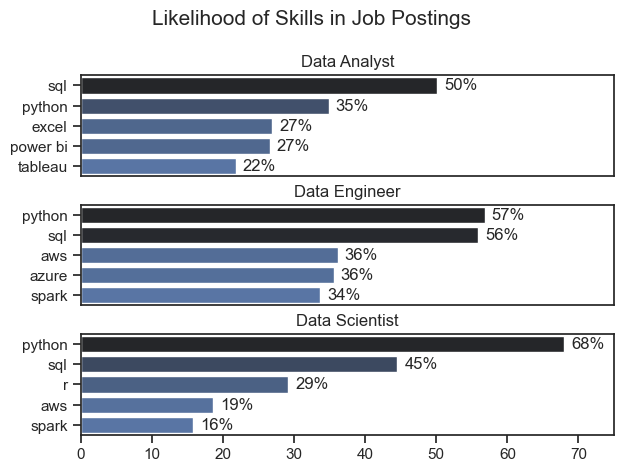
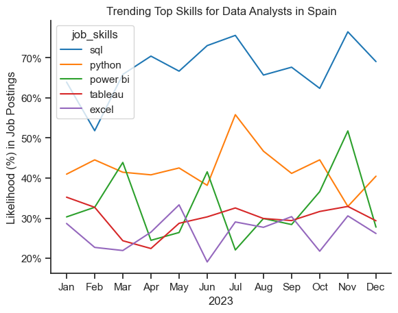
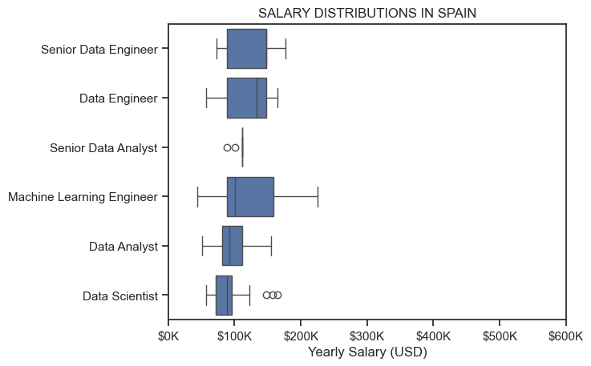
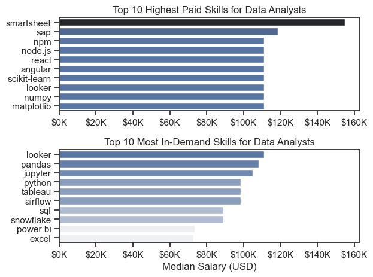

# The Analysis

## 1. What are the most demanded skills for the top 3 most popular data roles in Spain?

To find the most demanded skills for the top 3 most popular data roles in Spain. I filtered out those positions by which ones were the most popular, and got the top 5 skills for those top 3 roles. This query highlights the most popular job titles and their top skills, showing which skills I should pay attention to depending on the role I am targeting.

View my notebook with detailed steps here: [2_Skills_Demand_.ipynb](3_PROJECT\2_Skills_Demand_.ipynb)

### Visualize Data

'''python
fig, ax = plt.subplots(len(job_titles), 1)

sns.set_theme(style='ticks')
for i, job_title in enumerate(job_titles):
    df_plot = df_skills_perc[df_skills_perc['job_title_short'] == job_title].head(5)
    sns.barplot(data=df_plot, x='skills_percent', y='job_skills', ax=ax[i], hue='skill_count', palette='dark:b_r')

plt.show()
'''

### Results

### Insights

Across data roles, SQL is the universal foundation, Python is indispensable, BI tools define analysts, and cloud/big data skills distinguish engineers, while data scientists rely most on Python with some support from SQL and R.

## 2. How are in-demand skills trending for Data Analysts in Spain

### Visualize Data

'''python

from matplotlib.ticker import PercentFormatter

df_plot = df_DA_SPA_percent.iloc[:, :5]

sns.lineplot(data=df_plot, dashes=False, palette='tab10')
sns.set_theme(style='ticks')
sns.despine()

plt.show()

'''

### Insights

In 2023, SQL clearly dominated job postings for data analysts in Spain, consistently appearing in around 60–75% of advertisements and establishing itself as the core technical requirement. Python followed as the second most in-demand skill, maintaining steady relevance at 40–50% with a notable mid-year peak in July. Power BI showed more volatile demand, fluctuating widely between 20% and 50%, with sharp surges in March, June, and November, suggesting episodic but significant interest. Tableau, in contrast, displayed a relatively stable presence at 25–35%, with a modest upward trend towards the end of the year. Excel, once foundational, exhibited a gradual decline, dropping from nearly 30% in January to below that threshold mid-year and closing the year with reduced prominence. Collectively, these patterns suggest that SQL and Python remain indispensable, Power BI reflects shifting but important business intelligence needs, while Tableau holds steady as a secondary visualization tool and Excel continues to recede in importance.

## 3. How well do jobs and skills pay for Data Analysts in Spain in 2023?

### Salary Analysis

#### Visualize Data

'''python
sns.boxplot(data=df_SPA_top6, x='salary_year_avg', y='job_title_short', order=job_order)
sns.set_theme(style='ticks')

plt.title('SALARY DISTRIBUTIONS IN SPAIN')
plt.xlabel('Yearly Salary (USD)')
plt.ylabel('')
plt.xlim(0, 600000)
ticks_x =plt.FuncFormatter(lambda y, pos: f'${int(y/1000)}K')
plt.gca().xaxis.set_major_formatter(ticks_x)
plt.show() 

'''

#### Results

*Box plot visualizing the salary distributions for the top 6 data job titles.*

#### Insights

The salary distribution plot for data-related roles in Spain highlights distinct patterns across job categories. Senior Data Engineers and Data Engineers occupy the higher salary ranges, with most earnings clustered around USD 100K–150K, indicating that engineering-focused roles are among the best compensated. Machine Learning Engineers also demonstrate broad salary variability, with a distribution stretching beyond USD 200K, reflecting both strong demand and specialized skill premiums. Data Scientists show a narrower spread, generally below USD 120K, though a few outliers suggest occasional high-paying opportunities. In contrast, Data Analysts and Senior Data Analysts earn comparatively lower salaries, mostly concentrated between USD 60K–100K, with fewer upper outliers, underscoring their relatively modest pay scale within the data profession. Overall, the hierarchy suggests that engineering and machine learning expertise command the highest rewards, while analytical roles, despite their prevalence, remain less lucrative in the Spanish market.

### Highest paid and most demanded skills for Data Analysts in Spain in 2023

#### Visualize Data

'''python

fig, ax = plt.subplots(2, 1)

sns.barplot(data=df_DA_top_pay, x='median', y=df_DA_top_pay.index, ax=ax[0], hue='median', palette='dark:b_r')
ax[0].legend().remove()

sns.barplot(data=df_DA_top_skills, x='median', y=df_DA_top_skills.index, ax=ax[1], hue='median', palette='light:b')
ax[1].legend().remove()

plt.show() 

#### Results

#### Insights

The comparison between highest-paid and most in-demand skills for data analysts in Spain reveals a striking divergence between market value and popularity. On the salary side, specialized tools and programming environments such as **Smartsheet, SAP, and npm** command the highest median pay, with Smartsheet standing out significantly above the rest at nearly USD 160K, highlighting the premium for niche enterprise and workflow management expertise. Other high-paying skills, including **Node.js, React, Angular, and scikit-learn**, emphasize the value of software engineering and machine learning integration within analytics roles. Conversely, the most in-demand skills reflect the everyday toolkit of data analysts: **Looker, Pandas, Jupyter, and Python** dominate job postings, underscoring the centrality of data manipulation, visualization, and scripting in practice. Widely adopted platforms such as **SQL, Excel, Power BI, and Tableau** remain highly requested but are associated with comparatively lower pay, suggesting their ubiquity reduces wage differentiation. Collectively, this contrast shows that employers most frequently seek mainstream, accessible tools, yet the highest compensation is reserved for rarer, more technical, or enterprise-focused skillsets.
